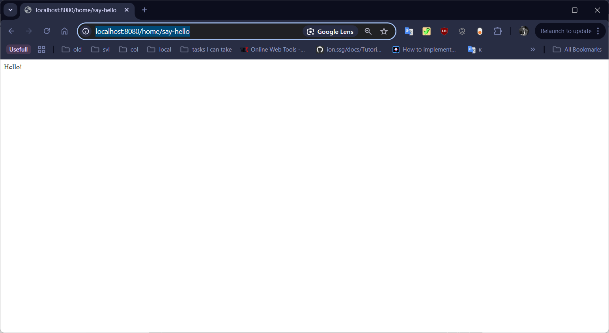
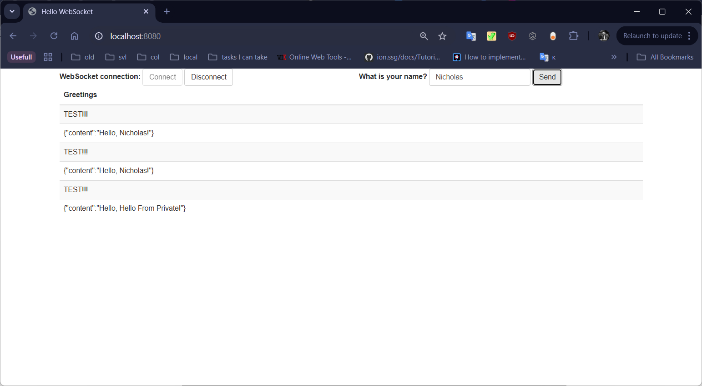
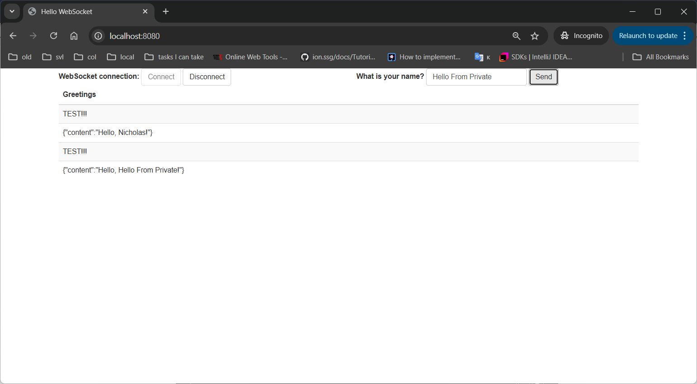

# What this project is about?

This is just a test project from [Spring.io](https://spring.io/guides/gs/messaging-stomp-websocket)
Where I try to create a simple WebSocket application.

You can access it via [this](http://localhost:8080) address...

# It's Not Just A Copy-Paste!
**The main scope** of this project was not **_just trying the WebSocket_** on Spring but also to 
**_combine REST-ful Api and WebSocket in a single Application_**. (You can get a simple REST Api 
response [here](http://localhost:8080/home/say-hello)

Also:
- here I tried to **_send messages directly to the broker_** that **confirms the fact** that messages
that come from the WebSocket controller - are just new WebSocket messages 
_(basically the message that comes to the controller - just transformed a little bit)_ that are mapped 
by the broker.\
- it **confirms the fact** that prefix is used just to redirect it to WebSocket controller 
_(but not directly on the broker)_

# Some Screenshots

- REST-ful Api response:

 
 
 
 
- WebSocket Connection for two clients (_usual_ and _private_ browser tabs)
    - **_Usual Browser Tab_**
  

 
 
    - **_Private Browser Tab_**

  
 
 

### Here comes another very important conclusion! : 
**The** broker itself **will RECEIVE messages on the topic/** path, 
b**ut will only send them to subscribers of the full path**. 

That is, if a message is sent **from the WebSocket controller** to the address **_/topic/news/1_**, 
then the broker configured for **/topics** path **will intercept** this message, 
but **will send it not to all subscribers, but only to subscribers of _/topic/news/1_**. 

That is, subscribers of **/topic** and **/topic/news** will not receive this message 
- only subscribers of **/topic/news/1**.